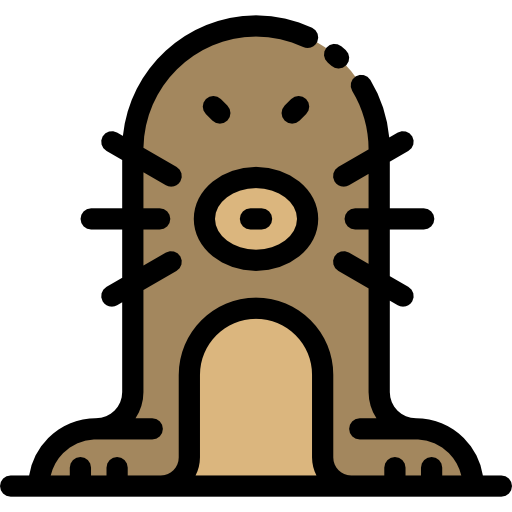

# MoleScan  
[]()

#### This script is a simple port scan that I developed for ctf games  
#### based on the tcp protocol using the socket library,  
#### the rest of which is just perfumery.  

# Usage:  
```
Clone the repository:  
einstein@blackhole:~# git clone https://github.com/Outs1d3r-NET/MoleScan.git  

Enter the folder and make the necessary changes to the variables as desired:  
einstein@blackhole:~# cd MoleScan && vi MoleScan.py  

Run the script:  
einstein@blackhole:~# python3 MoleScan.py  
```  

# Info:
#### Variables:  
###### ir = Initial range port: Change this variable for manipulated the range initial.  
###### fr = Final range port: Change this variable for manipulated the range final.  
###### cr = Current range port: This variable is a counter.  
###### iP = Internet Protocol: This variable is target address.  
###### oPP = Open ports: this Variable is a list open ports found in target.  
